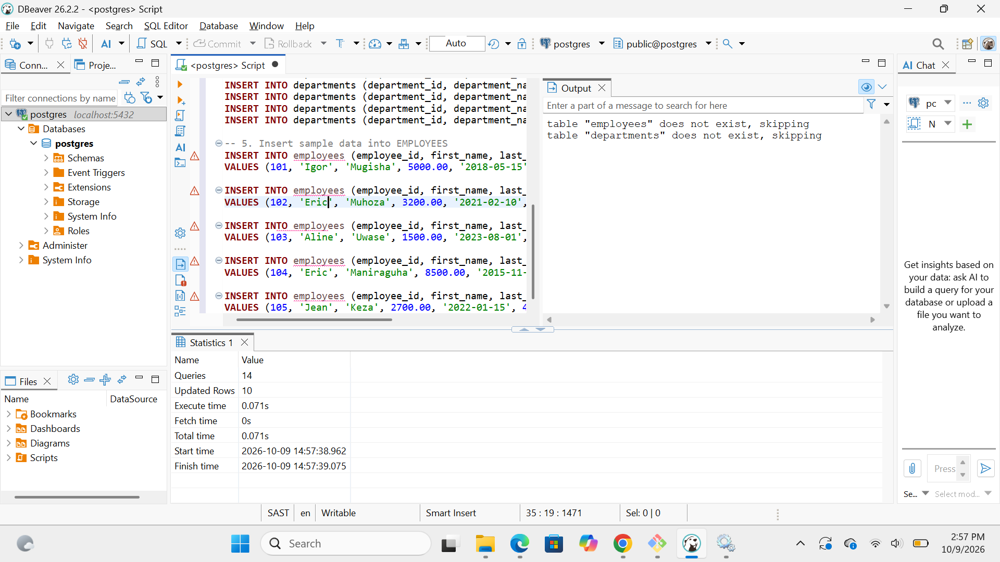
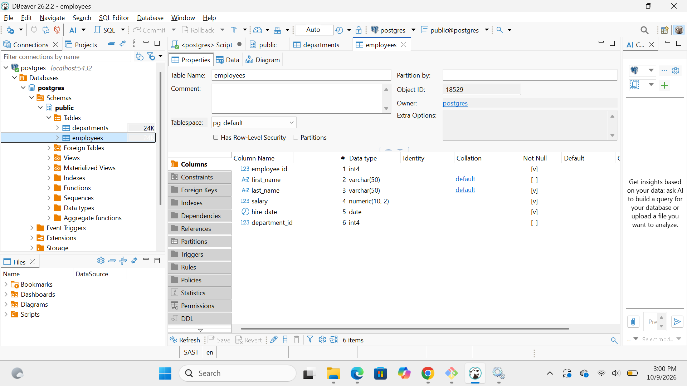
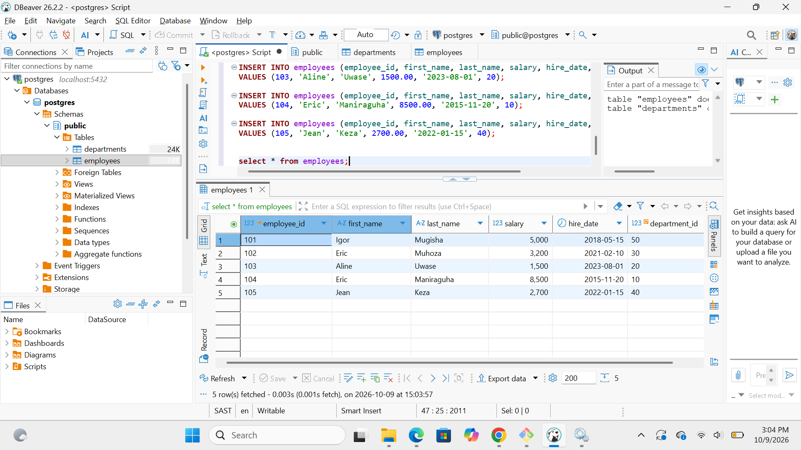
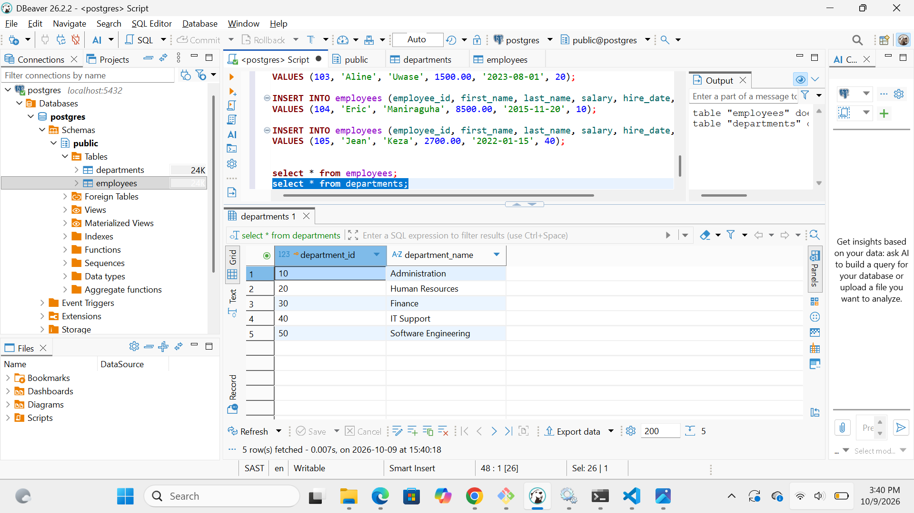

# Assignment Reflection - PL/SQL GOTO Statements and Functions

## Overview
This assignment explored control structures, procedural logic using GOTO statements, stored functions, and integration with SQL queries.

## GOTO Statements vs. Structured Programming
- **GOTO Usage:** Useful for unconditional branching, but excessive use creates unstructured code that is difficult to debug and maintain.
- **Scope Restrictions:** In PL/SQL, GOTO cannot jump into an `IF` statement, `LOOP`, or sub-block from outside (PLS-00375).
- **Structured Alternatives:** Using `IF-ELSIF-ELSE` and `CASE` statements produces cleaner, more maintainable code.

## Stored Functions
- Functions encapsulate business logic (e.g., annual salary, tax computation, department lookup).
- Functions can be called directly inside SQL `SELECT` queries, enabling powerful data transformation directly within query execution.

---

## Execution Screenshots

### 1. Database Schema & Setup Script Execution

### 2. Employees Table Structure

### 3. Populated Employees Table Output

### 4. Populated Departments Table Output

